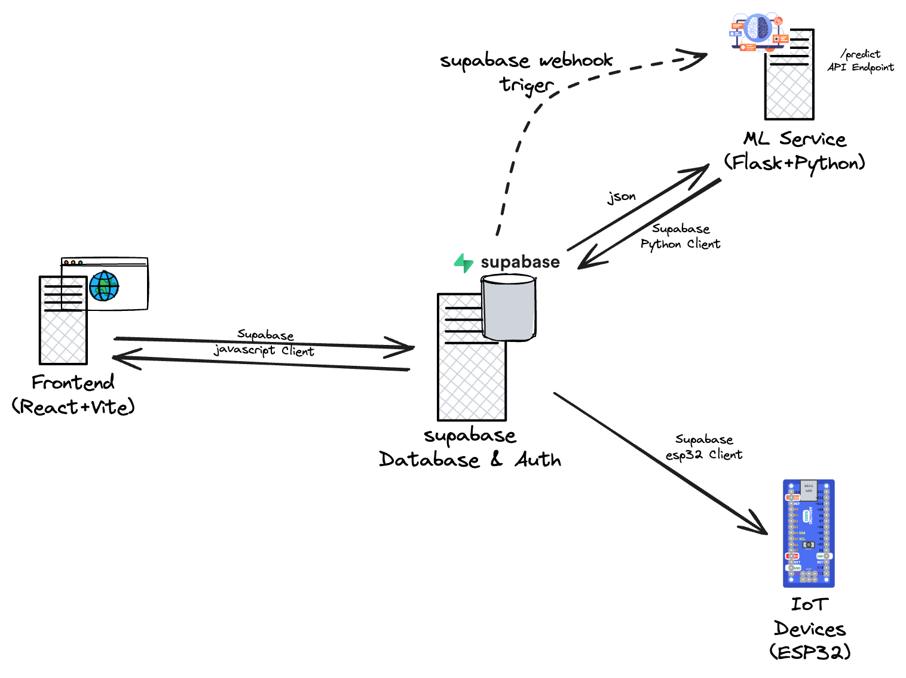

# CircadiaLux

<picture>
  <source srcset="CircadiaLux_w_logo.png" media="(prefers-color-scheme: dark)">
  <source srcset="CircadiaLux_b_logo.png" media="(prefers-color-scheme: light)">
  
</picture>


A comprehensive system for managing circadian rhythm-friendly lighting environments in healthcare settings.

## Overview

CircadiaLux is an integrated solution that combines web technologies, IoT devices, and machine learning to provide personalized lighting environments that support patients' circadian rhythms for better sleep and recovery outcomes.

## Demo & Blog

🎬 **Watch the Demo Video**  
https://github.com/user-attachments/assets/e86ebcab-8507-4811-84ae-7ccb82573952

📝 **Read the Full Story**  
Discover the challenges, design process, and systems thinking behind CircadiaLux in this blog post:  
👉 [CircadiaLux: Revolutionizing Healthcare Lighting with ML, IoT, and Human-Centered Design](https://blog.kavindalj.me/blog/CircadiaLux)

- **Frontend**: React application with Tailwind CSS providing interfaces for administrators and caretakers
- **Backend**: Supabase for authentication, database storage, and real-time updates
- **IoT**: ESP32-based devices for monitoring and controlling lighting parameters
- **ML**: Machine learning component for personalized lighting recommendations

## System Architecture



The CircadiaLux system follows a distributed architecture where:
- Healthcare professionals interact with the system through the React frontend
- Supabase serves as the central database and authentication hub
- ML service generates personalized lighting predictions triggered using Supabase webhooks and sends as JSON data to Flask API endpoint
- ESP32-based IoT devices control the physical lighting environment using sensor-based feedback loop control mechanism

## Project Structure

```
CircadiaLux/
├── frontend/     # React web application
├── IoT/          # ESP32 firmware and hardware designs
├── ML/           # Machine learning prediction service
└── supabase/     # Database schema and configuration
```

## Key Features

- 📊 **Dashboard Views** for administrators and caretakers
- 👤 **User Management** for creating and managing user accounts
- 🔌 **Device Management** for setting up and monitoring CircadiaLux devices
- 👨‍⚕️ **Patient Management** for associating patients with caretakers and devices
- 🤖 **ML-driven Lighting** recommendations based on patient profiles
- 🔐 **Authentication** with role-based access control

## Component Documentation

- [Frontend README](frontend/README.md) - Setup and usage of the web application
- [IoT README](IoT/README.md) - Hardware specifications and firmware setup
- [ML README](ML/README.md) - Machine learning model information
- [Supabase README](supabase/README.md) - Database schema and configuration

## Installation and Setup

First, clone the repository:

```bash
git clone https://github.com/kavindalj/CircadiaLux.git
cd CircadiaLux
```

For the best results, we recommend setting up the CircadiaLux system in the following order. For each component (except database), navigate to the component directory with `cd component-name` before following its setup instructions.

1. **Database Setup (Recommended First Step)**
   - Start with the Supabase configuration as it's the foundation of the system
   - Follow instructions in the [Supabase README](supabase/README.md)
   - This will create all necessary tables and security policies

2. **Machine Learning Component**
   - Set up the ML prediction service after the database
   - Follow instructions in the [ML README](ML/README.md)
   - Make sure to download a pre-trained model or train one yourself by following the provided steps.

3. **Frontend Application**
   - Configure and launch the web interface next
   - Follow instructions in the [Frontend README](frontend/README.md)
   - Connect to your Supabase instance using environment variables

4. **IoT Devices**
   - Finally, set up the physical hardware components
   - Follow instructions in the [IoT README](IoT/README.md)
   - Configure devices to connect to your Supabase instance

## System Requirements

- **Supabase**: Any tier (including free tier for development)
- **Frontend**: Node.js 18.x or later, npm 9.x or later
- **ML**: Python 3.10+, pip, and dependencies listed in requirements.txt
- **IoT**: PlatformIO, ESP32 development board, and supporting components

## Contributing

We welcome contributions to CircadiaLux! Please check our [Contributing Guide](CONTRIBUTING.md) for guidelines on how to proceed.

## License

CircadiaLux is licensed under the [MIT License](LICENSE). See the [LICENSE](LICENSE) file for more details.
